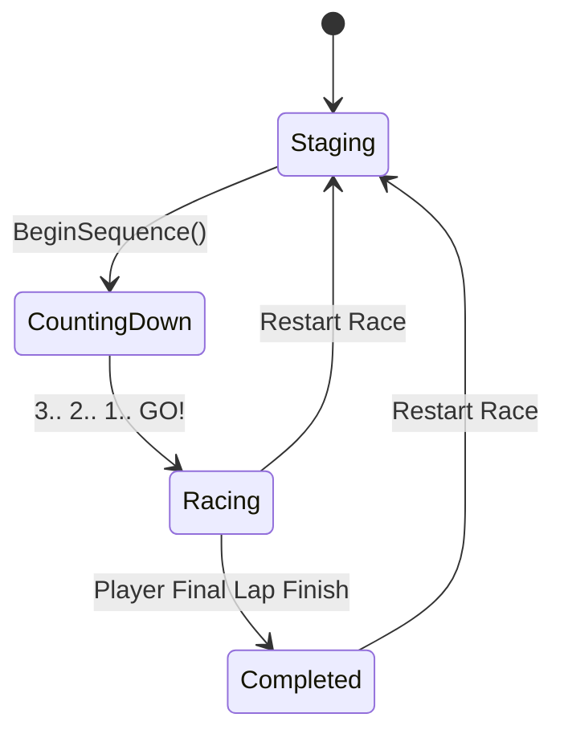

# Race System Specification (Phase 5, 6 & 7)

## Overview
The Race System orchestrates race staging, start countdowns, checkpoint progression, lap counting, and race completion. It maintains clear boundaries between physical track structure (`TrackManager`, `TrackCheckpoint`) and temporal race governance (`RaceCountdownController`, `LapSystem`, `RaceManager`).

## Design Pillars Served
- **Pillar 1: Readable Chaos**
  Clear, synchronized countdown signals and explicit lap progression (`Lap X / TotalLaps`) prevent confusion. Checkpoints only count when hit in sequence, eliminating accidental double-triggers or exploit cuts.
- **Pillar 2: Always a Comeback**
  Staggered grid positions (2x2 F1 format) combined with synchronized release ensure immediate slipstreaming opportunities off the line.
- **Pillar 3: One-Thumb Mastery**
  Race completion triggers the moment the player crosses the finish line on their final lap—arcade style—without forcing the player to wait for distant AI stragglers.

## State Machine Architecture

### `CountdownState` Enum
1. **`Staging`**:
   - Positions every vehicle onto its assigned `TrackManager.GetStartPosition(gridSlot)`.
   - Aligns rotations to `TrackManager.GetStartRotation(gridSlot)`.
   - Zeroes Rigidbody linear and angular velocities.
   - Snaps the player camera directly behind the player's grid slot.
   - Activates `VehicleController.SetControlsLocked(true)`.
   - Fires `OnStagingComplete` event (resets `LapSystem` progress and `RaceManager` results).
2. **`CountingDown`**:
   - Executes 1-second interval ticks (3.. 2.. 1..).
   - Fires `OnCountdownTick(int count)` on each step for UI numbers and audio beeps.
   - Controls remain strictly locked with auto-brake clamped.
3. **`Racing`**:
   - Releases all vehicles simultaneously in the same frame/pass (`SetControlsLocked(false)`).
   - Starts elapsed race stopwatch (`RaceTime`).
   - Fires `OnRaceStarted` event.

---

## Lap System & Checkpoint Validation (`LapSystem.cs`)

### Checkpoint Order & Direction Enforcement
`LapSystem` subscribes to `TrackCheckpoint.OnVehiclePassedCheckpoint`:
- Each vehicle maintains a `LapProgress` state:
  - `nextExpectedCheckpointIndex`: The exact checkpoint index the vehicle must cross next.
  - `lapsCompleted`: Number of valid laps completed.
  - `finished`: Whether all required laps have been recorded.
- **Grid Offset Alignment**: Because starting grids sit just behind the finish line (`Checkpoint 0`), `nextExpectedCheckpointIndex` initializes to `1` (or `0` if only 1 checkpoint exists). This prevents false lap completions upon rolling off the line.
- **Order Validation**: If a vehicle hits a checkpoint whose index does not match `nextExpectedCheckpointIndex` (e.g. driving backwards through a checkpoint or cutting across the infield), the trigger event is **silently ignored**. Progress never advances out of sequence.
- **Lap Completion**: When `Checkpoint 0` (`isFinishLine == true`) is crossed in sequence:
  - `lapsCompleted` increments.
  - Fires `OnLapCompleted(vehicle, lapsCompleted)`.
  - When `lapsCompleted >= trackManager.LapCount`, flags `finished = true` and fires `OnVehicleFinished(vehicle, finishTime)`.

---

## Race Completion & Result Evaluation (`RaceManager.cs`)

### Arcade-Style Player Finish
`RaceManager` listens to `LapSystem.OnVehicleFinished`:
- Adds vehicles to an internal `finishOrder` list in chronological order of finish line crossing.
- Evaluates the player's placement:
  $$\text{place} = \text{finishOrder.Count}$$
- The instant `vehicle == playerVehicle`, the player's race is declared complete (`raceConcludedForPlayer = true`).
- Fires `OnRaceCompleted(RaceResult)` with:
  - `vehicle`: Player vehicle reference.
  - `won`: `true` if `place == 1`.
  - `place`: Final finishing position (1st, 2nd, 3rd, etc.).
  - `finishTime`: Elapsed `RaceCountdownController.RaceTime`.
- **Non-Blocking Architecture**: Does not block on trailing AI vehicles. AI finishers continue to append to `finishOrder` for post-race leaderboards.

---

## Active Physics Validation
`Phase6_TestHarness` and `Phase7_TestHarness` include automated monitors checking all racers during `Staging` and `CountingDown`:
- If `rb.linearVelocity.magnitude > 0.05f`, an explicit warning is logged indicating parking brake failure or slope drift.
