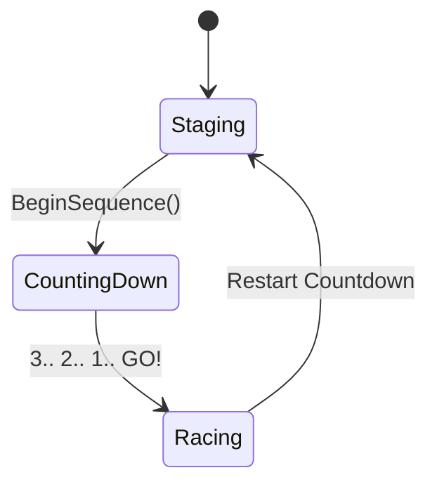

# Race System Specification (Phase 5 & 6)

## Overview
The Race System orchestrates race staging, start countdowns, checkpoint progression, lap counting, and race completion. It maintains clear boundaries between physical track structure (`TrackManager`, `TrackCheckpoint`) and temporal race governance (`RaceCountdownController`, `LapSystem`).

## Design Pillars Served
- **Pillar 1: Readable Chaos**
  Clear, synchronized countdown signals (visual numbers, sound cues, and instantaneous green-light controls unlock) guarantee that all racers launch simultaneously without confusion or unfair advantages.
- **Pillar 2: Always a Comeback**
  Staggered starting grid positioning (2x2 F1 format) combined with synchronized release ensures immediate slipstreaming opportunities off the line.

## State Machine Architecture



### `CountdownState` Enum
1. **`Staging`**:
   - Positions every vehicle onto its assigned `TrackManager.GetStartPosition(gridSlot)`.
   - Aligns rotations to `TrackManager.GetStartRotation(gridSlot)`.
   - Zeroes Rigidbody linear and angular velocities.
   - Snaps the player camera directly behind the player's grid slot.
   - Activates `VehicleController.SetControlsLocked(true)`.
   - Fires `OnStagingComplete` event.
2. **`CountingDown`**:
   - Executes 1-second interval ticks (3.. 2.. 1..).
   - Fires `OnCountdownTick(int count)` on each step for UI numbers and audio beeps.
   - Controls remain strictly locked with auto-brake clamped.
3. **`Racing`**:
   - Releases all vehicles simultaneously in the same frame/pass (`SetControlsLocked(false)`).
   - Starts elapsed race stopwatch (`RaceTime`).
   - Fires `OnRaceStarted` event.

## Physics-Level Controls Lock vs Component Disabling
Rather than disabling input scripts (`TouchVehicleInput`, `KeyboardVehicleInput`), `VehicleController.SetControlsLocked(bool)` executes an internal physics override:
```csharp
if (controlsLocked)
{
    throttleInput = 0f;
    steerInput = 0f;
    brakeInput = true; // Auto-brake clamped
}
```
**Benefits:**
- **Decoupled Across Humans & AI**: AI vehicles (Phase 8) and touch/keyboard players use the exact same lock API.
- **Active Suspension**: Suspension springs and dampers continue calculating, keeping vehicles settled firmly on tarmac.
- **Slope & Bank Resistance**: Parking brake force prevents vehicles from rolling on inclined start grids.
- **Future Rocket-Start Ready**: Input components remain active to capture throttle intent for launch boost bonuses.

## Active Physics Validation
`Phase6_TestHarness` includes an automated monitor checking all racers during `Staging` and `CountingDown`:
- If `rb.linearVelocity.magnitude > 0.05f`, an explicit warning is logged indicating parking brake failure or slope drift.
